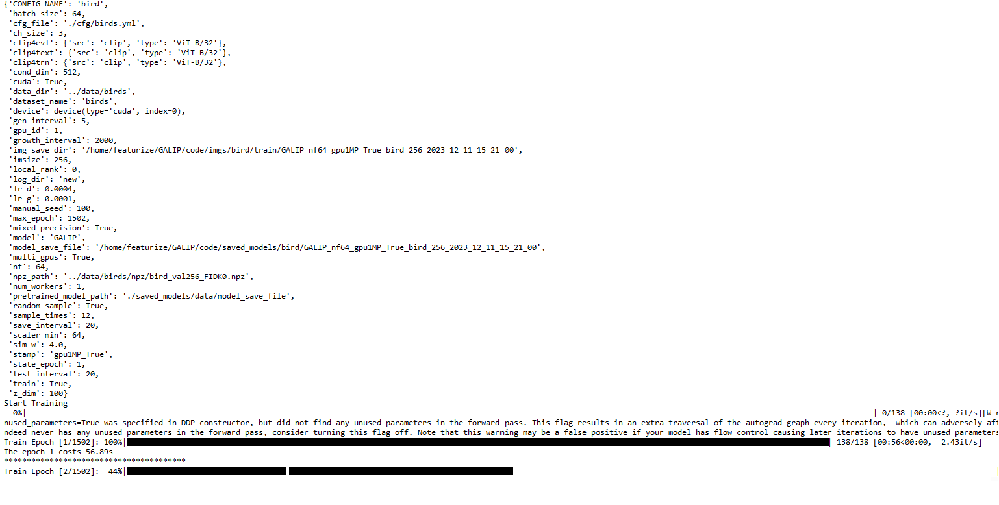

# GALIP: Generative Adversarial CLIPs for Text-to-Image Synthesis (CVPR 2023)


## A high-quality, fast, and efficient text-to-image model

Official Pytorch implementation for our paper [GALIP: Generative Adversarial CLIPs for Text-to-Image Synthesis](https://arxiv.org/abs/2301.12959) by [Ming Tao](https://scholar.google.com/citations?user=5GlOlNUAAAAJ), [Bing-Kun Bao](https://scholar.google.com/citations?user=lDppvmoAAAAJ&hl=en), [Hao Tang](https://scholar.google.com/citations?user=9zJkeEMAAAAJ&hl=en), [Changsheng Xu](https://scholar.google.com/citations?user=hI9NRDkAAAAJ). 

## Requirements
- python 3.9
- Pytorch 1.9
- At least 1x24GB 3090 GPU (for training)

## Installation

Clone this repo.
```
git clone https://github.com/tobran/GALIP
pip install -r requirements.txt
```
Install [CLIP](https://github.com/openai/CLIP)

## Preparation
### Datasets
1. Download the preprocessed metadata for [birds](https://drive.google.com/file/d/1I6ybkR7L64K8hZOraEZDuHh0cCJw5OUj/view?usp=sharing) and extract to `data/`
2. Download the [birds](http://www.vision.caltech.edu/visipedia/CUB-200-2011.html) image data. Extract them to `data/birds/`

## Training
  ```
  cd GALIP/code/
  ```
### Train the GALIP model
  - For bird dataset: `bash scripts/train.sh ./cfg/birds.yml`

### Resume training process
If your training process is interrupted unexpectedly, set **state_epoch**, **log_dir**, and **pretrained_model_path** in train.sh to resume training.

### TensorBoard
Our code supports automate FID evaluation during training, the results are stored in TensorBoard files under ./logs. You can change the test interval by changing **test_interval** in the YAML file.

  - For bird dataset: `tensorboard --logdir=./code/logs/bird/train --port 8166`

### Screenshot of the start of training


## Evaluation

### Evaluate GALIP models

  ```
  cd GALIP/code/
  ```
set **pretrained_model** in test.sh
- For bird dataset: `bash scripts/test.sh ./cfg/birds.yml`


### Citing GALIP

If you find GALIP useful in your research, please consider citing our paper:
```

@article{tao2023galip,
  title={GALIP: Generative Adversarial CLIPs for Text-to-Image Synthesis},
  author={Tao, Ming and Bao, Bing-Kun and Tang, Hao and Xu, Changsheng},
  journal={arXiv preprint arXiv:2301.12959},
  year={2023}
}

```

The code is released for academic research use only. For commercial use, please contact Ming Tao (陶明) (mingtao2000@126.com).

